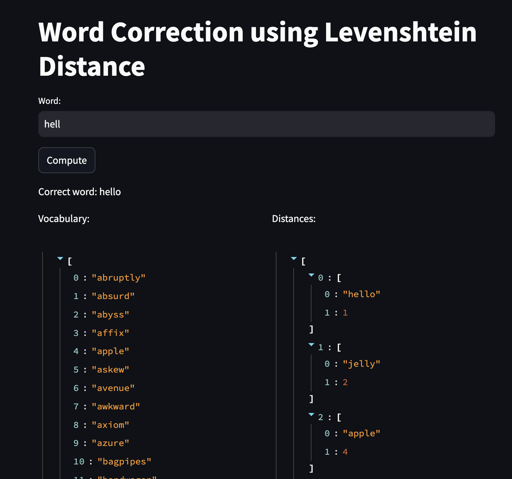

# Word Correction using Levenshtein Distance
The Word Correction project is designed to identify and correct spelling errors in text input. Utilizing algorithms such as the Levenshtein distance, this tool can suggest the most accurate corrections for misspelled words, making it an invaluable resource for applications requiring high levels of text accuracy, such as content creation tools, search engines, and educational software.


## Table of Contents
1. [Introduction](#introduction)
2. [Installation](#installation)
3. [Demo](#demo)

## Introduction

This project centers on the practical implementation of AI applications using Streamlit. Streamlit is an open-source Python library designed to simplify the creation and sharing of custom web apps for machine learning and data science. Within this project, you'll discover an application that provides correct spelling suggestions for input words by utilizing the Levenshtein distance algorithm.

## Installation

To run these applications locally, follow these steps:

1. Clone this repository:
```bash
git clone https://github.com/namdevdk2710/word-correction.git
cd word-correction
```

2. Install the required dependencies:
```bash
pip install -r requirements.txt
```

3. Run the applications using Streamlit:
- For Word Correction:
```bash
streamlit run main.py
```

## Demo

### Word Correction
<p align='center'>
  
</p>
